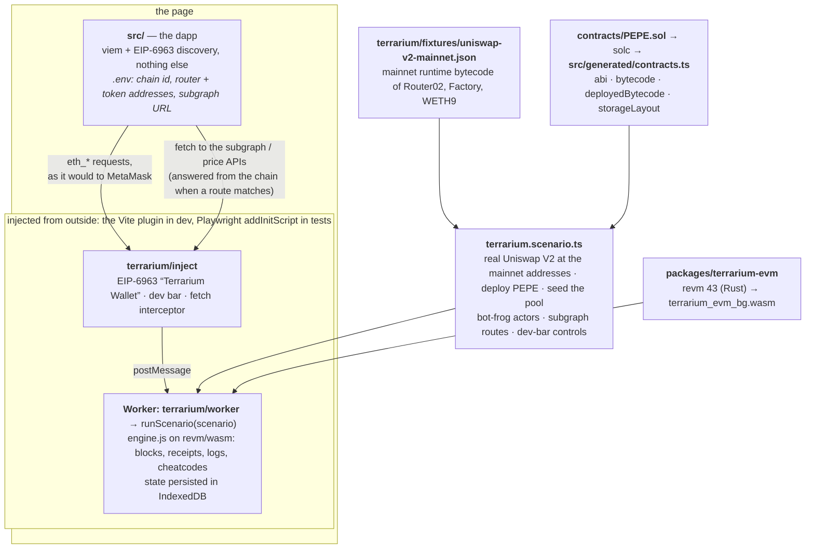

# Terrarium

A complete EVM chain that lives inside the page, presented to your dapp as a wallet. Real bytecode execution (revm
compiled to WebAssembly), real, verifiable blocks, receipts, logs and reverts, byte-identical to Anvil. No node process,
no browser extension, no faucet. Your dapp does not know it is there.

Two things it is for that a local node cannot do:

1. **Hosted previews and CI with zero infrastructure.** A Vercel preview URL, a Storybook, a Playwright run: the chain
   is injected into the page like a wallet extension would be. Deterministic, offline, no RPC quota.
2. **A live demo mode of your real dapp.** Visitors click through the production UI against real protocol contracts
   with fake money, with other actors trading around them, without installing anything.

Inside this repo: **Frogpond**, an ordinary ETH/PEPE dapp on the **real Uniswap V2** (mainnet bytecode of the
Router02, Factory and WETH9), used as the working example, and two lending frontends on recorded mainnet forks.

## Quickstart
```bash
npm install            # Node 22+. No Rust needed: the wasm engine ships prebuilt in packages/terrarium-evm/pkg
npm run dev            # http://localhost:5173 → "Connect wallet" → "Terrarium Wallet"
```
Add liquidity, swap, remove liquidity through the real router. In the dark bar at the bottom: mine blocks, shift
time, switch to 3 s blocks, snapshot and revert (chain **and** UI history come back), turn on **Pond life** (bot
frogs trade against you, one fades your swaps), make the wallet **reject** the next signature, answer **slowly**, or
deliver receipts **late**, take the dapp's **indexer down** or put it three blocks **behind** (the Uniswap V2 subgraph
the dapp queries is answered from the chain in the page). Reload the page: the chain is still there (IndexedDB, inside
a Worker). **Reset pond** wipes it and redeploys.

## More examples: real protocols, offline
| example | what | run |
|---|---|---|
| [examples/aave](examples/aave/README.md) | Aave V3 mainnet Pool, aTokens, oracle: supply, borrow, health factor vs the UI's math, interest, a price shock via a feed installed at the Chainlink address | `npm run example:aave` |
| [examples/euler](examples/euler/README.md) | Euler V2 mainnet vaults + EVC: deposit, enable collateral/controller, borrow, risk-adjusted liquidity, oracle staleness after time travel | `npm run example:euler` |

Each is a recorded mainnet fork (`record.mjs` → `fixtures/*.json`, ≈0.5 MB) restored offline: no RPC at run time, and any
read the fixture cannot answer is reported instead of fetched. `npm run test:examples` replays both.

## What you can put a frontend through
Every one of these is a scenario or a dev-bar button, on the real contracts, with no infrastructure. The primitives are
`deal` / `setState` (write leaf state), impersonated transactions (produce structural state), code installed at a real
address (`anvil_setCode` + storage by variable name), the chain clock, snapshots, actors and the wallet knobs.

| case | how | what you learn about the UI |
|---|---|---|
| **A position on the edge of liquidation, preloaded** | fork a lending protocol, `deal` the collateral, supply and borrow to the limit in `setup`, then nudge the price down with a fixed feed at the oracle's address (the Aave example's `ETH −30%` button) | does the health factor, the warning banner and the "repay" call to action react; is the UI's own math equal to the Pool's |
| **A liquidation happening to the user** | an actor that watches `Borrow` logs and, once the price feed is moved, calls `liquidationCall` from a funded account | the position card after someone else's transaction changed it; toasts and history rows for events the user did not send |
| **A bad oracle** | install the fixed feed with a zero, negative or absurd answer; or a feed whose `latestRoundData` is hours old (**+1 hour** on a fork does this for real: Euler's adapter reverts with `PriceOracle_TooStale`) | reverts with custom errors reach the user decoded; the UI does not show `NaN`, `Infinity` or a green health factor on stale data |
| **Illiquidity** | drain the pool: `deal` a whale, impersonate it and borrow every unit of `cash`; or on a DEX, remove most of the liquidity with the treasury account | `withdraw` and `borrow` revert with the protocol's own reason; quotes show the true price impact; the UI disables what cannot succeed before the wallet opens |
| **Slippage and price impact** | an actor trades a large size in the block before the user's swap (Frogpond's arbitrage frog fades every human swap) | `INSUFFICIENT_OUTPUT_AMOUNT` reaches the user as words; slippage settings actually change the outcome |
| **Insufficient funds mid-flow** | `sim_deal` the user's balance to zero after the form was filled in (the e2e does this) | the guard before the transaction, and the decoded `TransferHelper: TRANSFER_FROM_FAILED` when it slips through |
| **No approval, wrong approval** | send without the allowance; approve less than the amount; a token whose `approve` needs a reset to zero first | the approve/act two-step, and what happens when the second step fails |
| **The indexer is down, or behind the chain** | an `http` route answers the dapp's subgraph / API URL from the chain in the Worker (`graphql` resolvers over the real logs); a control makes it return 503 or answer three blocks late (Frogpond's `Indexer: down / behind` buttons) | the UI says the indexer is unavailable instead of showing an empty "no activity"; the user's own swap does not vanish from recent activity; numbers that gate a transaction come from the chain, not the indexer |
| **The wallet says no, the wallet is slow, the node lags** | **Reject next tx** (EIP-1193 4001), **Wallet: 2 s delay**, **Receipts: 3 s late** in the dev bar, or `terrarium_setWallet` from a test | pending states, spinners that resolve, no stuck "confirming" |
| **Interest and time** | **+1 hour**, or `evm_increaseTime(30 days)` + a block | balances that grow, APRs that render, deadlines that expire (a deadline built from `latest` or `Date.now()` fails here, exactly as it would on an idle real chain) |
| **A reorg-like head that moves backwards** | **Snapshot** → act → **Revert** | history and balances roll back; the dapp polls the head and reloads when the number drops (`usePond.ts`) |
| **Someone else is trading** | actors: random traders every N seconds, a keeper reacting to logs, a whale at a fixed time | live charts and feeds update without the user; attribution of events to "you" vs others |
| **A fresh user vs a returning one** | `persist` (chain survives reloads) vs **Reset**, `ctx.fresh` / `ctx.firstBoot` | first-run empty states, and a UI that restores from a long history |
| **Governance or admin changed a parameter** | `setState` on the protocol's config (reserve factor, LTV, pause flag) by storage layout, or impersonate the admin and call the setter | paused markets, changed limits, and how stale the UI's cached config is |
| **A frontend-math regression** | in a Node test, read the protocol's view function and compare with the UI's formula after every action (the examples do this for the health factor and borrowing power) | the numbers you show equal the numbers the contract enforces |

The tutorial shows how each primitive is used: [docs/tutorial-new-protocol.md](docs/tutorial-new-protocol.md).

## Documentation
[docs/README.md](docs/README.md) is the index: the [tutorial](docs/tutorial-new-protocol.md) (project anatomy, where the
bytes come from, four steps), [off-chain data](docs/http-and-subgraphs.md) (subgraphs and APIs answered from the chain),
the [cookbook](docs/cookbook.md) (every feature, one example) and the [API reference](docs/api.md).

## Your own protocol in four steps
See [docs/tutorial-new-protocol.md](docs/tutorial-new-protocol.md). It starts with what a project looks like folder by
folder and where every byte the chain executes comes from (fetched code, a recorded fork, or Solidity you compiled), then:
get the protocol in (`npx terrarium fetch-code` for bytecode, `npx terrarium record --chain 1 --block N` for the state of a
chain at a block), write `terrarium.scenario.ts`, add the Vite plugin, run it headless. Every option and RPC method:
[docs/api.md](docs/api.md).

## How it fits together



| where | what |
|---|---|
| `packages/terrarium/` | the library: `engine.js` (the chain), `scenario.ts`, `worker-runtime.ts`, `http.ts`, `bridge.ts`, `inject.ts`, `devbar.ts`, `vite-plugin.ts`, `bin/terrarium.mjs` (CLI) |
| `packages/terrarium-evm/` | the wasm engine: revm 43 compiled from Rust, driven by `engine.js` through a host interface; `pkg/` is committed, no Rust needed |
| `terrarium.scenario.ts` | the example scenario: what the chain contains when the page loads, and how its subgraph answers |
| `src/` | Frogpond, an ordinary dapp; `contracts/PEPE.sol` is compiled into `src/generated/` by `npm run build:contracts` |

- **The dapp never imports the simulator.** `src/` is configured by `.env` (`VITE_CHAIN_ID`, `VITE_ROUTER_ADDRESS`,
  `VITE_TOKEN_ADDRESS`, optional `VITE_RPC_URL`) and talks to whatever wallet announces itself. Build with
  `VITE_TERRARIUM=off` and not one byte of the simulator is in the bundle (the e2e asserts this).
- **The Terrarium is injected from outside.** In dev, the Vite plugin (`terrarium/vite`) adds one `<script>` to
  `index.html`. In tests, Playwright injects `dist-terrarium/terrarium.js` (`npx terrarium build`) with
  `addInitScript`, like a wallet extension. The dev bar is a plain-DOM overlay driven through `provider.request()`.
- **The chain runs in a Worker**, so a 3M-gas transaction never freezes the UI. Persistence is IndexedDB.
- **The pool is the real Uniswap V2.** `terrarium.scenario.ts` (`defineScenario`) installs the mainnet runtime
  bytecode at the mainnet addresses, deploys PEPE (your contract), seeds the pair through the router and declares the
  actors. The dapp uses the Router02 / Pair ABIs it would use on mainnet.

## Tests
```bash
npm test               # = test:unit + test:fork + test:examples. No network, no Foundry, no browser.
npm run test:unit      # Node's test runner over test/unit/*.test.mjs: chain, txs, cheatcodes, state, logs/actors, wallet,
                       # persistence, fork mode (offline fixture + a local fake node), the wasm engine, the scenario runtime,
                       # the bridge, the Vite plugin, the CLI (incl. a standalone build)
npm run test:fork      # offline replay of a recorded mainnet fork (real USDC proxy, real USDC/WETH pair): a new swap, zero network
npm run test:examples  # Aave + Euler offline replays (health factor vs UI math, interest, price shock, staleness)
npm run test:uniswap   # real Uniswap V2 in the Terrarium vs Anvil: tx hashes, receipts, logs, calls, reverts byte-identical; every block's
                       # header hash / tx root / receipts root / bloom recomputed from RPC output; RPC parity table (needs Foundry)
npm run e2e:install    # once: Chromium for Playwright
npm run e2e            # plain dapp build (VITE_TERRARIUM=off) + injected Terrarium, the whole flow in headless Chromium
npm run test:fork:record   # re-record the fork fixture against mainnet (needs network); record:aave / record:euler likewise
npm run build:wasm     # rebuild the wasm engine (Rust: rustup target add wasm32-unknown-unknown, cargo install wasm-bindgen-cli)
```
The e2e covers: connect via the picker, approve + add liquidity, a deposit with no funds (the real router's
`TransferHelper: TRANSFER_FROM_FAILED`, decoded), the wallet rejecting a signature (4001), a 2 s wallet delay with a
visible pending state, swaps both ways, the subgraph panel listing them and surviving an indexer outage (HTTP 503 from
the dev bar), snapshot → swap → revert, LP approval + remove, reload, and Pond life. It is also
the only place the dev bar, the injected wallet and IndexedDB persistence run for real; the unit suite covers everything
that has a Node equivalent.

## The engine directly (Node, Vitest, your own harness)
```ts
import { createTerrarium, indexedDBStorage } from 'terrarium';
const sim = await createTerrarium({
  chainId: 8453,
  persist: { storage: indexedDBStorage('my-dapp'), key: 'scenario' },
  seed: 42,                          // deterministic actors
  clock: () => fixedSeconds,         // deterministic block timestamps (tests)
  gasEstimation: 'fast',             // skip geth-style estimation in CI
  wallet: { latencyMs: 800 },        // a wallet that behaves like a wallet
});
await sim.deal(USDC, user, 5_000n * 10n ** 6n);          // fake balance on any ERC20, proxies included
sim.onLog({ address: vault, topics: [DepositTopic] }, (log) => sim.sendAs(keeper, {...}));  // other parties react
sim.provider                                             // the wallet (EIP-1193)
sim.node                                                 // the same chain as a node RPC: no accounts, no signing
await sim.provider.request({ method: 'terrarium_setWallet', params: [{ rejectNext: 1 }] });
```
Fork a live chain instead of starting empty: `createTerrarium({ chainId: 1, fork: { url, blockNumber } })`; every
remote read is recorded, so `sim.dumpState()` is an offline fixture (`test/fork-record.mjs` / `test/fork-offline.mjs`).

## The engine and its speed
Execution is revm 43 compiled to WebAssembly (`packages/terrarium-evm`, 1.5 MB wasm, no C dependencies), verified byte
for byte against Anvil by `npm run test:uniswap`:

| | 14-tx Uniswap scenario incl. 14 gas estimations |
|---|---|
| Terrarium (revm in wasm, in Node) | ≈135 ms (≈35 ms inside the wasm) |
| Anvil, native, for comparison | ≈75 ms |

The wasm only executes; state, checkpoints, blocks, receipts, persistence and fork recording are JavaScript around it.
revm reads state through a synchronous, checkpoint-aware mirror; anything the mirror has never seen is zero (local chain)
or fetched, recorded and re-run (fork mode), so the same code path serves both. Rebuild the wasm with
`npm run build:wasm` (needs `rustup target add wasm32-unknown-unknown` and `wasm-bindgen-cli`). The `@ethereumjs/vm`
engine that used to be the reference was removed in 0.3; the remaining `@ethereumjs/*` packages provide the state trie,
RLP, transactions and block headers, not execution.

## Two things a real chain hides that this one will show you
- **Deadlines.** Derive them from the `pending` block (`getBlock({ blockTag: 'pending' })`), not from `latest` and not
  from `Date.now()`. On an idle Terrarium the latest block can be hours old; with the dev bar the chain clock can be
  ahead of the wall clock. The real Uniswap router answered `EXPIRED` to a deadline built from `latest`.
- **Wallet errors.** viem retries "unknown" RPC errors three times with backoff. A provider that throws a plain object
  for a revert costs a second per failed estimate; the Terrarium's errors extend viem's `BaseError` for that reason.

## Honest limits
- Fork mode has no local state trie (remote state is unknown), so forked chains report a placeholder `stateRoot`
  (configurable). Everything else in the header is real and verifiable in every mode.
- No JS-mocked contracts: `mockContract` left with the JS engine. Mock with bytecode instead: install a small contract at
  the address (`anvil_setCode`) and set its variables (`setState`), as the Aave example does with its price feed.
- `eth_subscribe` pushes new heads only (as EIP-1193 `message` events); no log subscriptions. viem polls, which works.

## Docs
- [docs/tutorial-new-protocol.md](docs/tutorial-new-protocol.md): your protocol in four steps, use cases, troubleshooting.
- [docs/api.md](docs/api.md): every option, `sim` member, RPC method, scenario field, plugin option, CLI command, test id.
- [packages/terrarium/README.md](packages/terrarium/README.md), [packages/terrarium-evm/README.md](packages/terrarium-evm/README.md): the two packages.
- `CLAUDE.md`: operating manual and hard rules (also read by Claude Code). `HANDOFF.md`: the story, pass by pass.
- `docs/design-investigation.md`: the original investigation (Sep 2026). Historical: see its status note.
