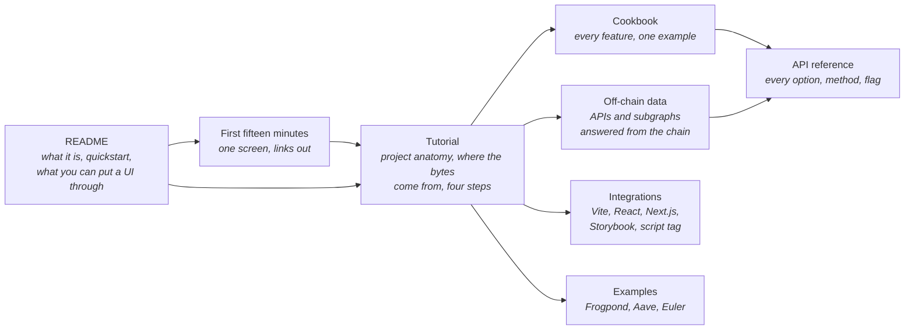

# Terrarium documentation

A complete EVM chain inside the page, presented to your dapp as a wallet. These pages take you from "what is this" to
"my protocol runs in it, offline, in CI", and then serve as the reference.

## 🚀 Start here

| read | when | you get |
|---|---|---|
| 🏠 [README](../README.md) | first | what the Terrarium is and is not, the quickstart, the table of things a frontend gets wrong that a scenario can show |
| ⏱️ [The first fifteen minutes](first-fifteen-minutes.md) | you want to see it work before reading anything long | install, the plugin, a scenario, run, break things; one screen with links out |
| 🧭 [Tutorial: your dapp against a new protocol](tutorial-new-protocol.md) | you are adding it to a project | the shape of a project folder by folder; the three sources of bytes (fetched code, a recorded fork, your own Solidity) and why you never compile Aave; compiling contracts; the four steps; troubleshooting |
| 🕸️ [Off-chain data: APIs, subgraphs and indexers](http-and-subgraphs.md) | your dapp reads a subgraph or an API | how the dapp's `fetch` is answered from the chain, GraphQL resolvers, the failure modes (down, behind, slow), the Frogpond example |
| 🔌 [Integrations](integrations.md) | your app is not on Vite, or you want the Terrarium in a Storybook or a deployed page | the Vite plugin (with its `mount: 'react'` option), the `@terrariumlabs/react` component (Next.js, Remix, CRA, Storybook), the script tag, the viem transport for wagmi; how to check the production bundle |
| 🍳 [Cookbook](cookbook.md) | you know what you want the chain to do | one paste-able example per feature: money, storage, time, snapshots, actors, wallet failures, forks, an Anvil deployment imported, persistence, status, the transaction explorer, several scenarios, wagmi |
| 📖 [API reference](api.md) | you need the exact shape | every `createTerrarium` option, `sim` member, RPC method, scenario field, plugin option, CLI flag, dev-bar test id |
| 🧭 [Roadmap](roadmap.md) | you wonder what is missing, or want to contribute | the known gaps and the features that would close them, in order, with sizes; what is deliberately not planned |
| 🔬 [Design investigation](design-investigation.md) | you want to know why it is built this way | the analysis behind the engine choice, state handling, fidelity testing (long; historical) |

## 🧪 The examples

| example | what it shows | docs |
|---|---|---|
| Frogpond (repo root) | a DEX dapp on the real Uniswap V2 bytecode; your own token; bot actors; a subgraph answered from the chain with down / behind controls | [README](../README.md), [terrarium.scenario.ts](../terrarium.scenario.ts), [e2e](../e2e/frogpond.e2e.mjs) |
| [examples/aave](../examples/aave/README.md) | a lending dapp on a recorded mainnet fork; health factor vs the UI's math; a price shock through a stand-in oracle | its README explains why it has one Solidity file and no Aave source |
| [examples/euler](../examples/euler/README.md) | vaults + EVC on a recorded fork; risk-adjusted liquidity; real oracle staleness after time travel | its README |

## 🛠️ For contributors

[HANDOFF.md](../HANDOFF.md) tells the project's story, its decisions and its status, for whoever picks it up next.
[CLAUDE.md](../CLAUDE.md) is the operating manual, and it holds the hard rules: the dapp never imports the simulator,
you change EVM state and never RPC responses, every mutation goes through the RPC layer, and a fidelity claim needs the
differential test behind it.

Three test commands cover the project. `npm test` runs the unit suite plus the fork and example replays, with no
network. `npm run test:uniswap` compares the engine against Anvil and needs Foundry installed. `npm run e2e` drives the
dapp in headless Chromium.

## ✍️ Conventions in these docs

`ctx` is the scenario context you get inside `setup`, `actors`, `methods` and `http` handlers. `sim` is the engine when
you run it in Node. `rpc(method, params)` stands for `window.terrarium.request` in a browser test. All three drive the
same chain.

Addresses in the examples are the real mainnet ones, such as the Uniswap V2 Router02, the Aave V3 Pool, WETH and USDC.
The ten accounts are the Anvil / Hardhat test accounts, and `accounts[0]` is the user in the browser.

"The dev bar" is the dark bar at the bottom of the page in dev mode. Every button on it is also an RPC call, named in the
[API reference](api.md#injected-page-globals).
