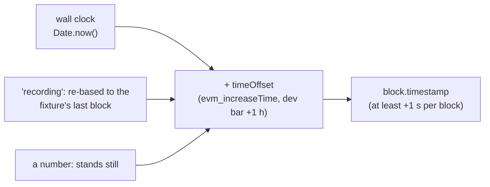

# Cookbook: every feature, one example

← [Docs index](README.md) · [Tutorial](tutorial-new-protocol.md) · [Off-chain data](http-and-subgraphs.md) · [API reference](api.md)

Each recipe is a few lines you can paste into a scenario (`ctx` is the scenario context), a Node script (`sim` from
`createTerrarium`) or a Playwright test (`rpc` = `window.terrarium.request`). The three are the same chain behind the
same RPC surface, so a recipe written for one works in the others with the obvious renaming: `ctx.rpc(m, p)` ≡
`sim.provider.request({ method: m, params: p })` ≡ `rpc(m, p)`.

**Contents**
1. [Money: balances, tokens, allowances](#1-money-balances-tokens-allowances)
2. [Storage by variable name](#2-storage-by-variable-name)
3. [Code at an address: stand-ins and upgrades](#3-code-at-an-address-stand-ins-and-upgrades)
4. [Acting as someone else](#4-acting-as-someone-else)
5. [Time](#5-time)
6. [Blocks and mining](#6-blocks-and-mining)
7. [Snapshots](#7-snapshots)
8. [Logs, filters, subscriptions](#8-logs-filters-subscriptions)
9. [Actors: other people on the chain](#9-actors-other-people-on-the-chain)
10. [The wallet misbehaving](#10-the-wallet-misbehaving)
11. [Gas](#11-gas)
12. [What-if calls: state overrides](#12-what-if-calls-state-overrides)
13. [Persistence, reset, first boot](#13-persistence-reset-first-boot)
14. [Forks: online, offline, recorded](#14-forks-online-offline-recorded)
15. [Following a live chain](#15-following-a-live-chain)
16. [Off-chain data: APIs and subgraphs](#16-off-chain-data-apis-and-subgraphs)
17. [Your own buttons and RPC methods](#17-your-own-buttons-and-rpc-methods)
18. [Reading status from tests](#18-reading-status-from-tests)
19. [The engine in Node and in Vitest](#19-the-engine-in-node-and-in-vitest)
20. [The wallet vs the node view](#20-the-wallet-vs-the-node-view)
21. [Randomness that replays](#21-randomness-that-replays)
22. [Proving a block is real](#22-proving-a-block-is-real)
23. [React without the Vite plugin](#23-react-without-the-vite-plugin)

The rule behind all of them: **write leaf state, produce structural state.** Balances, allowances, an oracle answer,
a config flag can be written directly. Pool reserves, positions, interest indexes, LP supply must be produced by real
transactions, or the protocol's invariants break in ways your UI will faithfully display.

## 1. Money: balances, tokens, allowances

```ts
await ctx.rpc('anvil_setBalance', [user, toHex(parseEther('100'))]);            // ETH
await ctx.sim.deal(USDC, user, 5_000n * 10n ** 6n);                              // any ERC20, proxies included: finds the balance slot by watching SLOADs
await ctx.sim.deal(USDC, user, 0n);                                              // …and takes it away again (the e2e does this mid-flow)
await ctx.wait(ctx.wallet(user).writeContract({ address: USDC, abi: erc20Abi, functionName: 'approve', args: [POOL, maxUint256] }));   // allowances: a real tx, so Approval is emitted
```

`deal` adjusts `totalSupply` too (pass `{ adjustTotalSupply: false }` to leave it). It throws `no direct storage slot` for
tokens whose balance is computed (rebasing tokens, vault shares): impersonate a holder and transfer, or mint through
the protocol. From a test: `rpc('sim_deal', [token, holder, '0x0'])`.

## 2. Storage by variable name

```ts
// the compiler's storageLayout (see the tutorial's "Compiling your own contracts") names slots for you
await ctx.sim.setState(FEED, FixedPriceFeed.storageLayout, { answer: 1_800n * 10n ** 8n, decimals: 8, roundId: 1 });
await ctx.sim.setState(TOKEN, MyToken.storageLayout, { owner: ctx.accounts[9], paused: true, balances: { [user]: parseEther('1') } });   // mappings: nested objects
await ctx.rpc('anvil_setStorageAt', [addr, '0x3', pad('0x01', { size: 32 })]);    // when you know the slot
const slot = ctx.sim.slotFromLayout(layout, ['balances', user]);                   // just compute the slot
```

Scalars, mappings with address / uint / bytes32 / string keys and dynamic arrays are supported; packed variables are not
(write the whole slot with `anvil_setStorageAt`). Governance-style scenarios live here: flip a pause flag, change a
reserve factor, lower an LTV, then see what the UI cached.

## 3. Code at an address: stand-ins and upgrades

```ts
await ctx.install(fixture);                                                       // runtime code from `terrarium fetch-code`, only where nothing is deployed yet
await ctx.rpc('anvil_setCode', [CHAINLINK_ETH_USD, FixedPriceFeed.deployedBytecode]);   // a stand-in at the real address: every consumer keeps reading "the oracle"
await ctx.sim.setState(CHAINLINK_ETH_USD, FixedPriceFeed.storageLayout, { answer: 900n * 10n ** 8n, decimals: 8, roundId: 1 });
const original = await ctx.codeAt(CHAINLINK_ETH_USD);                             // remember it, put it back later
```

Use `deployedBytecode`, never `bytecode` (creation code) here: no constructor runs, so set what the constructor would
have set with `setState`. This is the only kind of "mock" that exists: bytecode at an address. There is no JavaScript
mock of a contract, on purpose.

## 4. Acting as someone else

```ts
await ctx.sim.sendAs(WHALE, { to: POOL, data: encodeFunctionData({ abi: poolAbi, functionName: 'withdraw', args: [WETH, maxUint256, WHALE] }) });   // no key needed
await ctx.rpc('anvil_impersonateAccount', [ADMIN]);                               // …or the Anvil way, then eth_sendTransaction from ADMIN
await ctx.rpc('eth_sendTransaction', [{ from: ADMIN, to: POOL, data: setterCalldata }]);
await ctx.rpc('anvil_stopImpersonatingAccount', [ADMIN]);
```

Impersonated transactions carry an Anvil-style fake signature, so they hash, RLP and appear in blocks like any other.
Drain a pool as a whale, call an admin setter, liquidate the user from a keeper account: this is how.

## 5. Time

```ts
await ctx.rpc('evm_increaseTime', [3600]); await ctx.rpc('evm_mine');            // an hour later (negative values allowed)
await ctx.rpc('evm_setNextBlockTimestamp', [Number(ctx.sim.now()) + 86_400]);     // the next block at an exact time
const deadline = ctx.deadline(600);                                               // 10 minutes from the CHAIN clock, for router / permit deadlines
```

Three clock modes in `defineScenario`: `'wall'` (default), `'recording'` (the wall clock re-based to a restored fixture's
last block, so recorded oracles stay fresh however old the fixture is), or a number (fixed; blocks then advance one
second at a time). In Node: `createTerrarium({ clock: () => seconds })`. Never `Date.now()` in a scenario or a dapp:
the dev bar's **+1 hour** moves the chain clock, not the wall.



## 6. Blocks and mining

```ts
await ctx.rpc('evm_mine');                                                        // one empty block (also anvil_mine / hardhat_mine [n])
await ctx.rpc('evm_setAutomine', [false]); await ctx.rpc('evm_setIntervalMining', [3000]);   // a block every 3 s: pending states become visible
await ctx.rpc('evm_setAutomine', [true]);                                         // back to a block per transaction
const pending = await ctx.pub.getBlock({ blockTag: 'pending' });                  // the next block: real number and timestamp, the mempool as transactions
```

The dev bar's **Blocks: instant / every 3s** toggles the same two calls. Gas is estimated against the pending block,
like geth, which is why `deadline` and anything time-based should come from it too.

## 7. Snapshots

```ts
const id = await ctx.rpc('evm_snapshot');
// …swap, borrow, crash the price…
await ctx.rpc('evm_revert', [id]);                                                // state, blocks, receipts, logs, filter cursors, the clock and the base fee all come back
```

A revert moves the head *backwards*. viem's `watchBlockNumber` ignores that, so a dapp should poll the head and reload
its history when the number drops or the hash changes (Frogpond's `usePond.ts` does). The recorders use snapshots to
exercise a protocol and dump a clean fixture afterwards.

## 8. Logs, filters, subscriptions

```ts
const swaps = await ctx.pub.getContractEvents({ address: PAIR, abi: pairAbi, eventName: 'Swap', fromBlock: 0n, strict: true });
const id = await ctx.rpc('eth_newFilter', [{ address: PAIR, topics: [SWAP_TOPIC] }]);
const fresh = await ctx.rpc('eth_getFilterChanges', [id]);                        // cursors survive snapshot reverts (clamped)
const unsubscribe = ctx.sim.onLog({ address: PAIR, topics: [SWAP_TOPIC] }, (log, { blockNumber }) => { /* runs after the block is sealed */ });
```

`eth_subscribe('newHeads')` answers and new heads arrive as EIP-1193 `message` events; viem's `custom` transport polls
anyway. Blooms are real, so a client filtering by bloom gets the same answers it would from a node.

## 9. Actors: other people on the chain

```ts
actors: [
  { name: 'random trader', every: 5000, run: async (ctx) => ctx.sim.sendAs(ctx.accounts[7], { to: ROUTER, value: toHex(parseEther('0.1')), data: buyCalldata(ctx) }) },
  { name: 'arbitrageur', on: (ctx) => ({ address: ctx.state.pair, topics: [SWAP_TOPIC] }), run: async (ctx, log) => { /* fade the swap a block later */ } },
  { name: 'liquidator', on: { address: ORACLE, topics: [ANSWER_UPDATED] }, run: async (ctx) => { /* liquidationCall from a funded keeper */ } },
],
actorsLabel: 'Pond life',
```

Off by default, toggled together (dev bar button, or `terrarium_actors(on?)`), their on/off state persists. A throwing
actor is logged as `[terrarium] actor … failed`, never fatal. Use `ctx.random()` for anything random so a seeded
scenario replays identically.

## 10. The wallet misbehaving

```ts
await rpc('terrarium_setWallet', [{ rejectNext: 1 }]);          // the next signature request fails with EIP-1193 4001 ("user rejected")
await rpc('terrarium_setWallet', [{ latencyMs: 2000 }]);        // every wallet method takes 2 s: pending states, double-click guards
await rpc('terrarium_setWallet', [{ receiptLagMs: 3000 }]);     // receipts appear 3 s after the block: "confirming…" that resolves late
const knobs = await rpc('terrarium_getWallet');
```

Same knobs as the dev bar's **Reject next tx / Wallet: 2s delay / Receipts: 3s late**, and as `wallet: { … }` in
`defineScenario` for a scenario that starts hostile. Reads are never delayed: the gate sits before the state lock.

## 11. Gas

```ts
gasEstimation: 'fast'                                                             // in defineScenario or createTerrarium: no estimation, block gas limit (CI speed)
const gas = await ctx.pub.estimateContractGas({ address: ROUTER, abi: routerAbi, functionName: 'swapExactETHForTokens', args, value, account: user });   // geth-style: full run against the pending block, 64/63 probe, binary search
```

A transaction a node would refuse (bad nonce, insufficient funds) gets a **failed receipt** with `droppedReason` instead of
vanishing, so `waitForTransactionReceipt` never hangs.

## 12. What-if calls: state overrides

```ts
// "what would this call return if the user had 1,000 WETH?" — without touching the chain
const out = await ctx.rpc('eth_call', [{ to: POOL, data }, 'latest', { [WETH]: { stateDiff: { [balanceSlot]: pad(toHex(parseEther('1000')), { size: 32 }) } } }]);
const rev = await ctx.rpc('eth_call', [{ to: TARGET, data: '0x' }, 'latest', { [TARGET]: { code: '0x60006000fd' } }]);   // run other code at an address for one call
```

The third `eth_call` parameter is a geth state-override set (`balance`, `nonce`, `code`, `state`, `stateDiff`). viem's
`simulateContract({ stateOverride })` uses it.

## 13. Persistence, reset, first boot

```ts
persist: `my-dapp-${fixture.blockNumber}`,    // IndexedDB key; false = in-memory. Key by fixture block so a re-recorded fixture starts fresh
async setup(ctx) {
  if (ctx.fresh) { /* block 0: deploy and seed (first boot, or after Reset) */ }
  if (ctx.firstBoot) { /* nothing persisted yet, even if a fixture was restored: deal the user their starting balances */ }
}
```

Reload the page: the chain, receipts and history are back. `terrarium_reset()` (dev bar **Reset**) stops actors, clears
the origin's IndexedDB store and the dev bar reloads; `setup` then runs on a fresh chain. In Node, `persist` takes any
`{ getItem, setItem }` store and `sim.dumpState()` / `loadState(dump)` are the primitives.

## 14. Forks: online, offline, recorded

```ts
// online: lazy reads from a node, recorded as they happen (the recorders' mode)
const sim = await createTerrarium({ chainId: 1, fork: { url: RPC, blockNumber: 21_000_000 } });
// offline: the fixture is the truth; a read it cannot answer throws OfflineStateError and shows up as a MISS
fork: { blockNumber: fixture.blockNumber, offline: true }, restore: fixture.dump, clock: 'recording'
// the escape hatch: the same scenario online when VITE_FORK_RPC is set
fork: { url: import.meta.env.VITE_FORK_RPC || undefined, blockNumber: fixture.blockNumber, offline: !import.meta.env.VITE_FORK_RPC }
sim.offlineMisses                                                                 // [{ kind: 'storage', key: '0x…:0x…' }]: what to warm in the recorder
```

Record with `npx terrarium record … --block N --chain 1 --script warm.mjs` (tutorial step 1B). A forked chain starts at
block N + 1, so `ctx.fresh` is never true there; use `ctx.firstBoot`.

## 15. Following a live chain

```ts
sim.followChain(RPC, { pollMs: 4000, onBlock: (n) => console.log('head', n) });   // mirror a live chain's block numbers and timestamps
sim.stop();                                                                       // stop timers and persistence
```

For demos that should feel like they run "on" a chain whose head keeps moving while the state is local.

## 16. Off-chain data: APIs and subgraphs

```ts
http: [
  { match: 'https://api.thegraph.com/subgraphs/name/uniswap/uniswap-v2', graphql: { swaps: (ctx, q) => swapsFromLogs(ctx, q), pair: (ctx, q) => pairFromReserves(ctx, q) } },
  { match: 'https://api.coingecko.com/api/v3/simple/price*', handler: () => ({ ethereum: { usd: 2000 } }) },
  { match: 'https://backend.example/', handler: () => reply({ message: 'maintenance' }, { status: 503 }) },
],
```

The dapp's `fetch` to those URLs is answered from the Worker; everything else goes to the network. The whole story, with
the failure modes (down, behind, slow) and the Frogpond example: [http-and-subgraphs.md](http-and-subgraphs.md).

## 17. Your own buttons and RPC methods

```ts
methods: {
  async terrarium_ethPrice(ctx, pct: number) { /* install the fixed feed, set answer, evm_mine */ return pct; },
  async terrarium_faucet(ctx, to: Address) { await ctx.sim.deal(USDC, to, 10_000n * 10n ** 6n); },
},
controls: [
  { label: 'ETH −30%', method: 'terrarium_ethPrice', params: [-30], title: 'Crash the ETH price 30 % below the recorded price' },
  { label: 'Mine 10 blocks', method: 'anvil_mine', params: [10] },                // any RPC method works as a button
],
```

Methods receive `ctx` then the params, are reachable through the provider (`rpc('terrarium_ethPrice', [-30])`) and run
outside the state lock, so they can call other RPC methods. They mutate EVM state; they never rewrite responses. The dev
bar renders `controls` in order as `control-0`, `control-1`, … for tests.

## 18. Reading status from tests

```js
const st = await rpc('terrarium_status');
// { chainId, engine: 'revm', block: '0x…', accounts, actors, actorsLabel, hasActors, wallet: { rejectNext, latencyMs, receiptLagMs },
//   controls, restoredFromPersistence, localBlocks, fork: null | { blockNumber, offline, misses }, http: { routes, hits }, ...status(ctx) }
```

Put the addresses your scenario deployed or discovered in `status(ctx)`; tests read them instead of hard-coding.

## 19. The engine in Node and in Vitest

```js
import { createTerrarium } from 'terrarium/engine';
const sim = await createTerrarium({ chainId: 31337, seed: 1, clock: () => 1_700_000_000 });   // deterministic blocks
const pub = createPublicClient({ chain, transport: custom(sim.provider) });
const test = createTestClient({ chain, mode: 'anvil', transport: custom(sim.provider) });     // viem's test actions work unchanged: setBalance, mine, snapshot…
```

Everything the Worker does, without a page: unit-test your frontend math against the real contracts, or drive a
scenario through `runScenario` from `terrarium/worker` (the unit suite does both). No network, no Foundry, no browser.

## 20. The wallet vs the node view

```js
sim.provider   // the wallet: eth_accounts lists the ten accounts, eth_sendTransaction signs, cheatcodes and terrarium_* work
sim.node       // the same chain as a read-only node: eth_accounts is [], wallet methods throw 4100
```

Hand `sim.node` to code that must behave as if it were talking to a public RPC (an indexer, a read client), and
`sim.provider` to the wallet side.

## 21. Randomness that replays

```ts
seed: 1337,                                   // defineScenario / createTerrarium
const r = ctx.random();                       // mulberry32 from the seed: the same actors make the same trades on every boot
```

Seeded scenarios give reproducible demos and deterministic e2e runs. Omit the seed for a fresh one per boot.

## 22. Proving a block is real

```js
const block = await pub.getBlock({ blockTag: 'latest', includeTransactions: true });
// header hash = keccak of the RLP header; transactionsRoot = trie of the block's txs; receiptsRoot = trie of EIP-2718 receipts;
// logsBloom = OR of the receipts' blooms; stateRoot = the Merkle trie root (merkle mode). test/uniswap-v2.mjs recomputes all of them
```

Blocks are sealed for real, so a client that verifies what it is told (a light client, a checker script) is satisfied.
`npm run test:uniswap` runs the same scenario here and on Anvil and compares byte for byte.

## 23. React without the Vite plugin

```tsx
// terrarium.worker.ts:  import scenario from './terrarium.scenario'; import { runScenario } from 'terrarium/worker'; runScenario(scenario);
import { Terrarium, useTerrarium, DevBar } from 'terrarium-react';
{import.meta.env.DEV && <Terrarium worker={() => new Worker(new URL('./terrarium.worker.ts', import.meta.url), { type: 'module' })} />}
const provider = useTerrarium();                         // in a child: the wallet provider for your own dev tools (null until ready)
<DevBar provider={provider} />                           // only the bar, over any provider answering terrarium_* methods
```

For Next.js, Remix, CRA and Storybook. Guard it with your bundler's development constant so production drops it, and check
the bundle once. Prefer the Vite plugin when you can: it keeps the simulator out of your source entirely.
[integrations.md](integrations.md) has the Next.js and Storybook recipes and the script-tag path for everything else.
