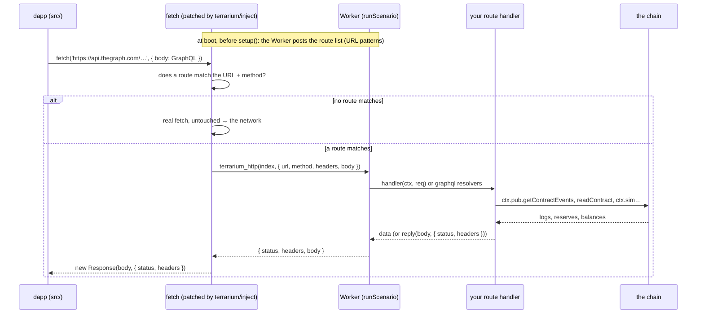
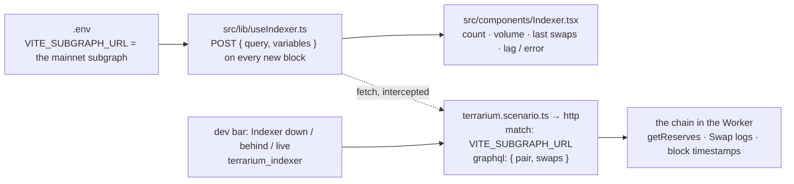

# Off-chain data: APIs, subgraphs and indexers answered from the chain

← [Docs index](README.md) · [Tutorial](tutorial-new-protocol.md) · [Cookbook](cookbook.md) · [API reference](api.md)

**Contents:** [The problem](#the-problem) · [How it works](#how-it-works) · [Declaring routes](#declaring-routes) ·
[Plain handlers](#plain-handlers-rest-apis) · [GraphQL resolvers](#graphql-resolvers-subgraphs) · [Failure modes](#failure-modes-down-behind-slow) ·
[Worked example: Frogpond](#worked-example-frogpond) · [Testing](#testing) · [Limits](#limits-and-rules) · [Reference](#reference)

## The problem

A frontend rarely reads the chain alone. It asks a subgraph for the last swaps and the 24 h volume, a price API for USD
values, its own backend for a leaderboard or a list of positions. Inside the Terrarium the chain lives in the page, and
there is no indexer next to it. Left alone, those requests would go to the real internet and describe a chain that is
not the one the user is clicking on: the subgraph would show mainnet swaps while the pool in the page has three.

The scenario can declare **HTTP routes**: which URLs to intercept and how to answer them with data computed from the
chain in the Worker. The dapp keeps sending the exact requests it sends in production, to the exact URLs in its `.env`.
Nothing in `src/` changes. This is the same principle as the wallet: the dapp talks to what it would talk to on mainnet,
and the Terrarium stands in for it from the outside.

## How it works



Three things worth knowing about the mechanics:

- **The interception is a patched `fetch` on the page**, installed by `startTerrarium` (the same code path the Vite
  plugin and the standalone bundle use). It is what a browser extension or a Service Worker would do. The dapp cannot
  tell; `Response` objects are real ones with the status, headers and body you returned.
- **The route list is announced before the chain boots**, so the dapp's first fetches are not held up by a long
  `setup()`. Requests that arrive before the list is known wait for it (milliseconds), then either go to the Worker or
  to the network.
- **Handlers run in the Worker with the scenario context**, outside the state lock, so they can read the chain through
  `ctx.pub`, call cheatcodes through `ctx.rpc`, and use whatever `setup()` left in `ctx.state`. A handler that throws
  produces a 500 with the message in the body and a console warning: the API failed, the way an API fails.

## Declaring routes

```ts
import { defineScenario, reply } from 'terrarium/scenario';

export default defineScenario({
  // …
  http: [
    { match: 'https://api.thegraph.com/subgraphs/name/uniswap/uniswap-v2', graphql: { /* resolvers, below */ } },
    { match: 'https://api.coingecko.com/api/v3/simple/price*', method: 'GET', handler: (ctx, req) => ({ ethereum: { usd: 2000 } }) },
    { match: /^https:\/\/backend\.example\/v1\/positions\/0x[0-9a-f]{40}$/i, handler: async (ctx, req) => { /* … */ } },
  ],
});
```

| field | meaning |
|---|---|
| `match` | a **string** is a URL prefix (`'https://api.example/v1/'` matches everything under it, query strings included); a string with `*` is a glob; a **RegExp** is tested against the full URL |
| `method` | restrict to one HTTP method; default any |
| `handler(ctx, req)` | answer the request (see below). With `graphql` present it acts as a gate: return `undefined` to let the resolvers answer |
| `graphql` | one resolver per top-level query field, for GraphQL endpoints |
| `name` | shows up in warnings and in `terrarium_httpRoutes`; optional |

Routes are tried in order; the first match wins. Requests that match nothing go to the network untouched, so a scenario
can intercept the subgraph and leave a fonts CDN alone.

The request a handler sees is plain data:

```ts
interface HttpRequest {
  url: string;                       // full URL
  method: string;                    // 'GET', 'POST', …
  headers: Record<string, string>;
  body: string | null;               // raw body (null for GET / HEAD)
  json: any;                         // the body parsed as JSON, or null
  query: Record<string, string>;     // the query string as an object
}
```

## Plain handlers (REST APIs)

Return what the API would return. A JSON-serialisable value becomes a `200 application/json` body (bigints are
serialised as decimal strings, since JSON has no bigint). A string becomes `200 text/plain`. For anything else, status
codes, headers, redirects, use `reply`:

```ts
{ match: 'https://api.coingecko.com/api/v3/simple/price*', method: 'GET',
  handler: async (ctx, req) => {
    // the price the pool implies, so the "≈ $x" labels in the UI agree with the chart
    const [r0, r1] = await ctx.pub.readContract({ address: ctx.state.pair, abi: pairAbi, functionName: 'getReserves' });
    const ethPerToken = Number(r1) / Number(r0);
    return { [req.query.ids]: { usd: ethPerToken * 2000 } };
  } },

{ match: 'https://backend.example/v1/notes', handler: (ctx, req) =>
    req.method === 'POST' ? reply({ saved: req.json }, { status: 201, headers: { 'x-request-id': '42' } })
                          : reply('gone fishing', { status: 503 }) },
```

Where the data comes from is up to you, and it should come from the chain: reserves through `readContract`, history
through `getContractEvents` or `eth_getLogs`, balances through `getBalance`. A handler that returns a constant is a
mock; a handler that reads the chain is an indexer.

## GraphQL resolvers (subgraphs)

Most dapps talk to at least one subgraph. Writing a GraphQL server for it is not the goal; answering the four queries
your UI sends is. `graphql` gives you one resolver per top-level field. The runtime parses the operation the client
posted, resolves each selected field with its arguments (variables substituted, defaults applied), and answers
`{ data: { field: result } }`, with `errors` entries for missing or throwing resolvers, as a real server would.

```ts
{ match: 'https://api.thegraph.com/subgraphs/name/uniswap/uniswap-v2',
  graphql: {
    // { swaps(first: 5, orderBy: timestamp, orderDirection: desc, where: { pair: $pair }) { id timestamp amount0In … } }
    swaps: async (ctx, q) => {
      const logs = await ctx.pub.getContractEvents({ address: ctx.state.pair, abi: swapEvent, eventName: 'Swap', fromBlock: 0n, strict: true });
      const rows = logs.map((l) => ({ id: `${l.transactionHash}-${l.logIndex}`, to: l.args.to, amount0In: formatEther(l.args.amount0In), /* … */ }));
      return rows.reverse().slice(0, Number(q.args.first ?? 100));
    },
    // { pair(id: "0x…") { reserve0 reserve1 txCount } }
    pair: async (ctx, q) => {
      if (q.args.id !== ctx.state.pair.toLowerCase()) return null;
      const [r0, r1] = await ctx.pub.readContract({ address: ctx.state.pair, abi: pairAbi, functionName: 'getReserves' });
      return { id: q.args.id, reserve0: formatEther(r0), reserve1: formatEther(r1), txCount: String(await countSwaps(ctx)) };
    },
  } }
```

What a resolver receives:

```ts
interface GraphqlQuery {
  field: string;       // 'swaps'
  alias: string;       // what the client wants it called ('recent' in `recent: swaps(...)`); defaults to field
  args: Record<string, unknown>;   // { first: 5, orderBy: 'timestamp', where: { pair: '0x…' } }  — variables substituted, enums as strings
  selection: string[]; // ['id', 'timestamp', 'amount0In']: the sub-fields asked for (one level), if you want to compute only those
  variables: Record<string, unknown>;
  operationName: string | null;
  query: string;       // the whole document, for anything the parser does not hand you
}
```

Return the shape the subgraph schema promises. Subgraphs return `BigInt` and `BigDecimal` as strings, so format numbers
the way the schema does (`formatEther` for an 18-decimal `BigDecimal`, `String(n)` for a `BigInt`) and the dapp's
existing parsing code keeps working. The parser handles operations with names and variables (with defaults),
aliases, nested argument objects and lists, enums, comments and directives. It does not expand fragments: a
`...PairFields` at the top level is skipped; nested fragments do not matter because you decide the result shape.

## Failure modes: down, behind, slow

The point of owning the indexer is to make it misbehave on purpose. Real indexers go down, lag behind the chain, and
answer slowly, and a frontend that only ever saw a healthy one has bugs waiting.

```ts
http: [{
  match: SUBGRAPH,
  // the gate: with `graphql` present, a handler that returns something answers instead of the resolvers
  handler: (ctx) => (ctx.state.indexer === 'down' ? reply({ message: 'indexer unavailable' }, { status: 503 }) : undefined),
  graphql: {
    swaps: async (ctx, q) => {
      const head = ctx.sim.blockNumber as bigint;
      const toBlock = ctx.state.indexer === 'behind' ? head - 3n : head;     // an indexer three blocks late
      if (ctx.state.indexer === 'slow') await new Promise((r) => setTimeout(r, 4000));   // a slow one
      return swapsUpTo(ctx, toBlock, q);
    },
  },
}],
methods: { async terrarium_indexer(ctx, mode) { ctx.state.indexer = mode; await ctx.rpc('evm_mine'); return mode; } },
controls: [
  { label: 'Indexer: down', method: 'terrarium_indexer', params: ['down'] },
  { label: 'Indexer: 3 blocks behind', method: 'terrarium_indexer', params: ['behind'] },
  { label: 'Indexer: live', method: 'terrarium_indexer', params: ['live'] },
],
```

What each one teaches you about the UI:

| indexer state | what the dapp must do | what usually goes wrong |
|---|---|---|
| **down** (HTTP 503, or a network error) | say so, keep the on-chain parts working, retry | a spinner forever; an empty list that looks like "no activity"; the whole page erroring because one panel did |
| **behind** (answers as of an older block) | show data as "as of block N" or detect the lag against the chain head | the user's own swap missing from "recent swaps" for a while; volume not matching the reserves shown next to it |
| **slow** | keep the last good data, show staleness | flicker to empty on every refetch; requests piling up |
| **disagrees with the chain** (different numbers for the same thing) | trust the chain for anything that gates a transaction | a "max" button computed from indexer balances |

## Worked example: Frogpond

The example dapp at the root reads the Uniswap V2 subgraph for the pond's swap count, volume and the last five swaps
(`src/lib/useIndexer.ts`, `src/components/Indexer.tsx`), configured by `VITE_SUBGRAPH_URL` in `.env`, which holds the
real mainnet subgraph URL. The scenario answers that URL from the chain
([terrarium.scenario.ts](../terrarium.scenario.ts), the `http` block): `pair` from `getReserves()` and the count of
`Swap` logs, `swaps` from the pair's `Swap` logs with block timestamps, ordered and paginated the way the query asks.
Three dev-bar buttons take the indexer down, put it three blocks behind and bring it back. The dapp shows the lag
("indexer is 3 blocks behind the chain") by comparing the newest indexed block with the head it reads from the chain,
which is exactly what a production frontend should do.



The e2e (`e2e/frogpond.e2e.mjs`) waits for the panel to list the swaps it just made, takes the indexer down from the
dev bar and asserts the UI says "Indexer unavailable: HTTP 503", then brings it back. The dev bar's status line shows
`N HTTP routes, M answered`.

## Testing

**From Playwright**, the route runs whenever the dapp fetches; you drive the failure modes through the dev bar buttons
(`control-<i>`) or your `terrarium_*` method, and you can call a route directly to check its output:

```js
const routes = await rpc('terrarium_httpRoutes');                         // [{ index, name, match, method }]
const res = await rpc('terrarium_http', [0, { url: SUBGRAPH, method: 'POST', headers: {}, body: JSON.stringify({ query: '{ pair(id: "0x…") { txCount } }' }) }]);
JSON.parse(res.body).data.pair.txCount;                                  // what the dapp will see
(await rpc('terrarium_status')).http;                                    // { routes, hits }
```

**In Node**, `runScenario` from `terrarium/worker` boots the scenario without a page, and `terrarium_http` works the
same way; `test/unit/http.test.mjs` does this, and also exercises the page side by installing the interceptor on a fake
`fetch`. The parser is exported from `terrarium/http` (`parseGraphql`) if you want to unit-test a resolver's inputs.

## Limits and rules

- **`fetch` only.** XMLHttpRequest and WebSocket are not intercepted. axios uses XHR in browsers by default; set
  `adapter: 'fetch'` (axios ≥ 1.7) or use a fetch-based client. GraphQL subscriptions over WebSocket are out of scope;
  poll instead, as the example does.
- **Requests made before the route list arrives wait for it.** The Worker posts the list before booting the chain, so
  this is milliseconds, not the whole `setup()`.
- **Do not intercept the chain.** RPC calls the dapp makes to a `VITE_RPC_URL` go through `fetch` too. Leave that URL
  unmatched; the wallet provider already is the chain. Rewriting RPC responses is the one thing the project forbids
  everywhere ("change EVM state, never RPC responses").
- **Compute from the chain, in the Worker.** A handler has `ctx`: `pub`, `sim`, `rpc`, `state`, `accounts`. It runs
  outside the state lock, so it may call any RPC method, including cheatcodes, but a handler that mutates the chain on
  a GET is a strange API; keep mutations in `methods`.
- **Bodies are strings.** Binary uploads and streamed responses are not modelled; JSON and text are.
- **Fragments are not expanded**, and there is no schema validation: a resolver answers what it answers. That is the
  intended trade: four queries answered honestly from the chain, not a GraphQL server.

## Reference

| where | what |
|---|---|
| `defineScenario({ http })` | `HttpRoute[]`: `{ name?, match: string \| RegExp, method?, handler?(ctx, req), graphql?: { field: (ctx, q) => … } }` |
| `reply(body, { status?, headers? })` from `terrarium/scenario` | an explicit answer; a string body is `text/plain`, anything else JSON |
| `terrarium_httpRoutes()` | the wire form of the routes: `[{ index, name, match: string \| { regex, flags }, method }]` |
| `terrarium_http(index, { url, method, headers?, body? })` | run one route; returns `{ status, headers, body }` |
| `terrarium_status().http` | `{ routes, hits }` |
| `terrarium/http` | `parseGraphql(source, variables?, operationName?)`, `compileMatcher`, `installHttpInterceptor(provider, routesPromise, scope?)`, `runRoute(ctx, route, raw)` for custom hosts and tests |

Next: the [cookbook](cookbook.md) for every other feature, one example each; the [API reference](api.md) for the exact shapes.
