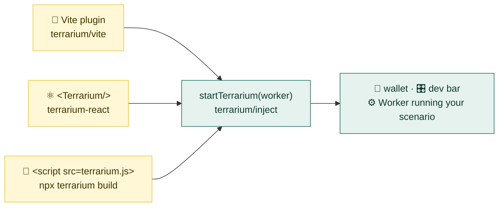

# Integrations: Vite, React, Next.js, Storybook, a plain script tag

← [Docs index](README.md) · [Tutorial](tutorial-new-protocol.md) · [Cookbook](cookbook.md) · [API reference](api.md)

**Contents:** [Which path](#-which-path) · [Vite plugin](#-vite-plugin-recommended) · [React component](#%EF%B8%8F-react-component-terrarium-react) ·
[Next.js](#-nextjs) · [Storybook](#-storybook) · [Script tag](#-a-plain-script-tag) · [Checking production](#-checking-the-production-bundle)

There are four ways to get the Terrarium (the chain in a Worker, the EIP-6963 wallet, the dev bar) onto a page. They all
end in the same call, `startTerrarium(worker)` from `terrarium/inject`; they differ in who makes that call and whether
your source has to mention it.

## 🧭 Which path

| you have | use | your source mentions the simulator? |
|---|---|---|
| a Vite app | the [Vite plugin](#-vite-plugin-recommended) | **no**: one `<script>` injected into `index.html` |
| Next.js, Remix, CRA, any React app not on Vite | [`terrarium-react`](#%EF%B8%8F-react-component-terrarium-react) | yes, behind a build-time guard |
| a Storybook | [`terrarium-react` in a decorator](#-storybook) or the script tag | in the Storybook config, not the app |
| a built site, someone else's dapp, a Playwright test | [a script tag](#-a-plain-script-tag) with `npx terrarium build` | **no** |



> [!IMPORTANT]
> The project's first rule is that **the dapp never imports the simulator**: what you test is what you ship, byte for
> byte. The Vite plugin and the script tag keep that rule for you. `terrarium-react` bends it: your source references the
> simulator, and only the guard you write keeps it out of production. Use it when you have to, guard it, and
> [check the bundle](#-checking-the-production-bundle) once.

## 🧩 Vite plugin (recommended)

```ts
// vite.config.ts
import { terrarium } from 'terrarium/vite';
export default defineConfig({
  plugins: [react(), terrarium()],                 // terrarium({ scenario: 'other.scenario.ts' })
  define: { 'process.env.DEBUG': 'undefined', 'process.env.TERRARIUM_DEBUG': 'undefined' },
  build: { target: 'es2022' }, worker: { format: 'es' },
});
```

The plugin writes `.terrarium/{inject,worker}.ts` (gitignore it) and injects one module script into `index.html`.
`VITE_TERRARIUM=off` in `.env` or the environment builds and serves the plain dapp. The [tutorial's step 3](tutorial-new-protocol.md#3-point-your-dapp-at-the-addresses-and-inject-the-terrarium) is the full walkthrough.

## ⚛️ React component (`terrarium-react`)

Two files. The Worker entry, which is what the Vite plugin would have generated:

```ts
// terrarium.worker.ts
import scenario from './terrarium.scenario';
import { runScenario } from 'terrarium/worker';
runScenario(scenario);
```

And the component at the root of your tree, behind your bundler's development constant:

```tsx
import { Terrarium } from 'terrarium-react';

export function Root() {
  return (
    <>
      {import.meta.env.DEV && <Terrarium worker={() => new Worker(new URL('./terrarium.worker.ts', import.meta.url), { type: 'module' })} />}
      <App />
    </>
  );
}
```

`new Worker(new URL('./file', import.meta.url), { type: 'module' })` is the form every modern bundler (Vite, webpack 5,
Next.js, Rspack, Parcel) recognises and bundles as a separate Worker chunk. The guard is a constant your bundler replaces
(`import.meta.env.DEV` in Vite, `process.env.NODE_ENV !== 'production'` in webpack and Next.js), so in a production build
the JSX, the Worker and the dynamic scenario import behind it are all dropped.

What the component does: on mount, in a browser, it creates the Worker, announces the wallet and mounts the dev bar; on
unmount it stops everything (`stopTerrarium`), which also makes React StrictMode's double-mount harmless. If a Terrarium is
already on the page (the Vite plugin, an injected script), it reuses it. Its children can call `useTerrarium()` to get the
provider for their own dev tools, and `<DevBar provider={…} />` mounts only the bar over any provider that answers the
`terrarium_*` methods. Full surface: [api.md](api.md#terrarium-react).

## ▲ Next.js

Next.js does not compile TypeScript from `node_modules` by default, and the Terrarium packages ship sources. Add them to
`transpilePackages`, and mount the component in a client component:

```js
// next.config.js
module.exports = { transpilePackages: ['terrarium', 'terrarium-react', 'terrarium-evm'] };
```

```tsx
// app/terrarium.tsx
'use client';
import { Terrarium } from 'terrarium-react';
export default function Dev() {
  if (process.env.NODE_ENV === 'production') return null;
  return <Terrarium worker={() => new Worker(new URL('../terrarium.worker.ts', import.meta.url), { type: 'module' })} />;
}
```

and render `<Dev />` once in `app/layout.tsx`. The `process.env.DEBUG` define the Vite config needs is not required:
webpack polyfills `process.env` for the browser. The component is a no-op during server rendering.

## 📚 Storybook

A global decorator mounts the Terrarium once for every story, so components that read the chain through a wallet
provider find "Terrarium Wallet" the way they would in the app:

```tsx
// .storybook/preview.tsx
import { Terrarium } from 'terrarium-react';
export const decorators = [(Story) => <Terrarium worker={() => new Worker(new URL('../terrarium.worker.ts', import.meta.url), { type: 'module' })}><Story /></Terrarium>];
```

Storybook's Vite builder also accepts the Vite plugin directly in `.storybook/main.ts` (`viteFinal`), which keeps the
app's source untouched. With the webpack builder use the decorator above.

## 📜 A plain script tag

```bash
npx terrarium build          # dist-terrarium/terrarium.js: chain, wallet, dev bar and the wasm in one classic script
```

```html
<script src="/terrarium.js"></script>   <!-- before the dapp's own scripts -->
```

Any page, any framework, no build integration: a deployed preview, a static export, a dapp you do not own. Playwright's
`page.addInitScript({ path: 'dist-terrarium/terrarium.js' })` is the same file injected before the page runs, which is
how the e2e tests work. The scenario's `import.meta.env.VITE_*` values are baked in at build time from the cwd's `.env`.

## ✅ Checking the production bundle

Whichever path you took, look once:

```bash
grep -rl "terrarium" dist/assets | wc -l      # 0 with the Vite plugin or the script tag; 0 with a correct terrarium-react guard
```

Frogpond's e2e does this on every run (`dappBundleIsPlain`). If the count is not zero with `terrarium-react`, the guard is
not a constant your bundler replaces: check `import.meta.env.DEV` vs `process.env.NODE_ENV` for your tool.
