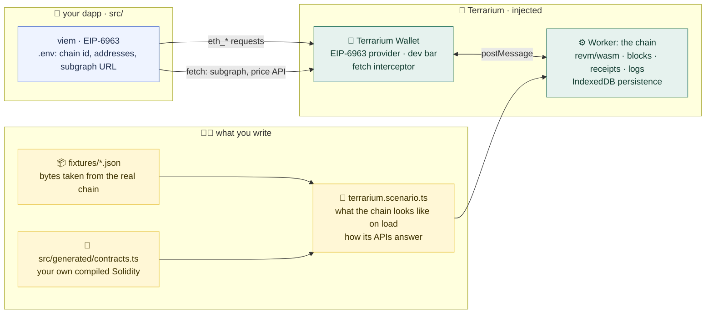
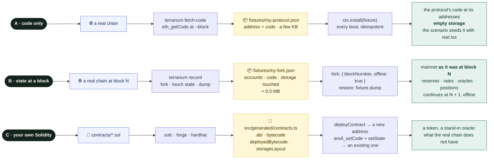

# Tutorial: your dapp against a new protocol

← [Docs index](README.md) · [Cookbook](cookbook.md) · [Off-chain data](http-and-subgraphs.md) · [API reference](api.md)

**Contents:** [How the pieces fit](#%EF%B8%8F-how-the-pieces-fit) · [The shape of a project](#%EF%B8%8F-the-shape-of-a-project) ·
[Where the bytes come from](#-where-the-bytes-come-from) · [Compiling your own contracts](#-compiling-your-own-contracts) ·
[1. Get the protocol in](#1-get-the-protocol-in) · [2. Write the scenario](#2-write-the-scenario) ·
[3. Inject the Terrarium](#3-point-your-dapp-at-the-addresses-and-inject-the-terrarium) · [4. Run it headless](#4-run-it-headless) ·
[5. Off-chain data](#5-off-chain-data-the-subgraph-and-the-apis) · [Scenarios worth writing](#-scenarios-worth-writing) ·
[Troubleshooting](#-troubleshooting)

You have a frontend for some protocol: a lending pool, a DEX, a vault. You want to click through it, run it in CI and
show it to people, without running a node, installing an extension or begging for test ETH. This tutorial takes you
from an empty folder to that, and explains the *why* along the way: what each folder is for, where the contract bytes
come from, why you never compile Aave, and when you do have to write Solidity.

The finished versions of everything built here are in this repo: **Frogpond** at the root (`terrarium.scenario.ts`, a
DEX on the real Uniswap V2) and `examples/aave` / `examples/euler` (lending, from recorded mainnet forks).

## 🗺️ How the pieces fit



Your dapp talks to a wallet, as it would to MetaMask. The wallet happens to be backed by a whole EVM chain running in a
Worker on the same page. The scenario file decides what that chain contains when the page loads; it gets its raw
material from two places: bytes fetched from a real chain (fixtures) and contracts you compiled yourself (generated).
The same scenario can answer the dapp's off-chain reads (a subgraph, a price API) from that chain, so the indexer agrees
with the pool the user is clicking on. Nothing in `src/` knows any of this exists.

## 🗂️ The shape of a project

This is what a finished project looks like. The right column says who reads each thing, which is the quickest way to
understand why it exists.

```
my-dapp/
├── .env                          chain id, contract addresses, API URLs read by the dapp (as it would be for mainnet)
├── src/                          your dapp                              knows nothing about the Terrarium
│   └── generated/contracts.ts    your compiled Solidity, typed          read by the scenario (and the dapp, for ABIs)
├── contracts/                    Solidity YOU wrote for the simulation  compiled into src/generated/ (see below)
│   └── out/*.json                the raw compiler artifacts             gitignored build output
├── fixtures/                     bytes taken from the real chain        read by the scenario
│   ├── my-protocol.json          A: the runtime code of a few contracts (terrarium fetch-code)
│   └── my-fork.json              B: the state of the chain at block N   (terrarium record, or record.mjs)
├── terrarium.scenario.ts         what the chain looks like when the page loads; how the dapp's APIs answer (http routes)
├── record.mjs                    B only: the script that produced fixtures/my-fork.json
├── test.mjs / e2e/               tests that drive the chain offline: Node against the engine, Playwright against the page
├── vite.config.ts                + the terrarium() plugin
└── .terrarium/                   two entry files the plugin generates; gitignore it
```

- **`.env`** holds the same things it would for mainnet: a chain id, the addresses the dapp talks to, the URL of its
  subgraph or API. Fixed mainnet addresses for a forked protocol; deterministic addresses for contracts your scenario
  deploys; the real indexer URL, which the scenario intercepts.
- **`src/`** is your product. It discovers wallets with EIP-6963 and uses whatever announces itself. Nothing in it
  imports or mentions the Terrarium. The moment it does, you are testing something other than what you ship.
- **`contracts/`** exists only if the simulation needs something that does *not* exist on the real chain: a demo token,
  a stand-in oracle. Most forked-protocol projects have one small file here or none at all.
- **`fixtures/`** is where the real chain's bytes live, as JSON, committed. Two kinds, explained next.
- **`terrarium.scenario.ts`** turns fixtures and generated contracts into a chain: install code, deploy, seed, define the
  other actors, expose buttons. It runs in the Worker on every page load.

## 🧬 Where the bytes come from

Everything the chain executes is bytecode. There is no JavaScript mock of a contract anywhere: if the pool's `borrow`
reverts, it is the pool's real bytecode reverting. So the whole question of "how do I get protocol X in" is "where do
the bytes come from", and there are exactly three sources:



### A. Code only: `fetch-code`

Take the runtime bytecode of a handful of contracts and put it at the same addresses in an otherwise empty chain. You
get a protocol that *works* but *remembers nothing*: a Uniswap factory with no pairs, a registry with no entries. Your
scenario then does what a deployer would: creates the pool, adds liquidity, mints the tokens. This is Frogpond: real
Uniswap V2 code, a pool your scenario seeded, a PEPE token you compiled.

It fits protocols whose state can be bootstrapped through their own functions. It is small and fast, and the state is
yours to shape.

### B. State at a block: `record`

Fork a real chain at block N. The Terrarium fetches state lazily: the first time the EVM touches an account, a code blob
or a storage slot, it is fetched from the node and *recorded*. Dump the recording and you have a fixture: the exact
bytes mainnet had at block N for everything your session touched, and nothing else. A scenario restores that fixture
and continues the chain at N + 1 with the network unplugged.

> [!NOTE]
> This is why **the Aave and Euler examples contain no Aave or Euler source code**. The Pool, its proxy, the
implementation behind it, the aTokens, the debt tokens, the oracle, the Chainlink aggregators, WETH, USDC: all of it
arrived as the bytes it actually is on mainnet, along with the storage that makes it meaningful (reserves, interest
indexes, risk parameters, the current price round). You never compile a protocol to fork it; you would only be rebuilding
bytes that already exist. What you *do* need is to touch every path the UI will take while recording, because a slot
the recorder never read is a slot the fixture does not have.

### C. Your own Solidity

Compile source only for what is *not* on the chain yet. In this repo that is two files: `contracts/PEPE.sol` (Frogpond's
demo token, deployed fresh) and `examples/aave/contracts/FixedPriceFeed.sol`, which deserves its own explanation.

**Why the Aave example has a `FixedPriceFeed.sol`.** Aave prices collateral through its oracle, which reads a Chainlink
aggregator at a fixed address. To watch the health factor react to a crash you need that price to move, and you cannot
ask Chainlink. So the scenario replaces the *code* at the aggregator's address with a 20-line contract that has the same
interface (`latestRoundData`, `latestAnswer`, `decimals`) and returns whatever `answer` you set. Every consumer keeps
calling the same address and keeps getting a Chainlink-shaped reply; only the number changed. Installing it is two
cheatcodes: `anvil_setCode` puts the bytecode there, `sim.setState` writes `answer`, `decimals` and `roundId` by variable
name using the compiler's storage layout. That is the whole `ETH −30%` button. The Euler example has no such file
because it only exercises what the recorded state already allows (deposit, borrow, interest, and staleness after time
travel, which is the real oracle reverting on purpose).

> [!IMPORTANT]
> The general rule: **write leaf state, produce structural state.** A balance, an allowance, an oracle answer can be
written directly. Pool reserves, positions, interest indexes must come from real transactions, or the protocol's
invariants break in ways your UI will faithfully display.

## 🧱 Compiling your own contracts

The scenario needs, per contract, up to four things from the compiler:

| field | needed for | how it is used |
|---|---|---|
| `abi` | everything | `deployContract`, `writeContract`, `readContract` through viem; `as const` gives you typed calls |
| `bytecode` (creation code) | **deploying** a new contract | `ctx.wallet(deployer).deployContract({ abi, bytecode, args })`: the constructor runs, storage is initialised |
| `deployedBytecode` (runtime code) | **installing** code at an existing address | `ctx.rpc('anvil_setCode', [address, deployedBytecode])`: no constructor runs, storage stays as it was |
| `storageLayout` | writing variables by name | `ctx.sim.setState(address, storageLayout, { owner: …, answer: … })` instead of hand-computing slots |

Any Solidity toolchain produces them; only the file layout differs.

**solc directly (what this repo does).** `scripts/build-contracts.mjs` is thirty lines: it compiles every `.sol` in a
folder with `solc-js`, asks for the four fields, writes a JSON artifact per contract into `contracts/out/` and one typed
TypeScript module. Copy the script, `npm i -D solc`, and:

```bash
node scripts/build-contracts.mjs contracts src/generated/contracts.ts
```

The output module looks like this, and both the scenario and (for ABIs) the dapp import from it:

```ts
// src/generated/contracts.ts — generated, do not edit
export const MyToken = { abi: [ /* … */ ] as const, bytecode: '0x6080…', deployedBytecode: '0x6080…', storageLayout: { storage: [ /* … */ ], types: { /* … */ } } } as const;
```

**Foundry.** Add `extra_output = ["storageLayout"]` to `foundry.toml`, run `forge build`, and read
`out/MyToken.sol/MyToken.json`: the fields are `abi`, `bytecode.object`, `deployedBytecode.object` and `storageLayout`.
A ten-line script can reshape that into the module above, or import the JSON straight into the scenario:

```ts
import artifact from '../out/MyToken.sol/MyToken.json';
const MyToken = { abi: artifact.abi, bytecode: artifact.bytecode.object as `0x${string}`, deployedBytecode: artifact.deployedBytecode.object as `0x${string}`, storageLayout: artifact.storageLayout };
```

**Hardhat.** `artifacts/contracts/MyToken.sol/MyToken.json` has `abi`, `bytecode` and `deployedBytecode`. The storage
layout is not emitted by default: add `storageLayout` to `solidity.settings.outputSelection` in the Hardhat config (or
use the `hardhat-storage-layout` plugin) and read it from the build-info file. If you never call `setState` on that
contract you can skip it.

Whatever the toolchain: commit the generated module (or the artifacts), never hand-edit them, and keep the compile as
an npm script so a contract change is one command away.

## 1. Get the protocol in

### A. Fetch the code

```bash
npx terrarium fetch-code router=0x7a250d5630B4cF539739dF2C5dAcb4c659F2488D factory=0x5C69bEe701ef814a2B6a3EDD4B1652CB9cc5aA6f weth=0xC02aaA39b223FE8D0A0e5C4F27eAD9083C756Cc2 \
  --rpc https://ethereum-rpc.publicnode.com --chain 1 --out fixtures/my-protocol.json
```

Add `--block N` to read the code as it was at a specific block (an upgradeable proxy's implementation changes over
time; a full node serves only its last ≈128 blocks, an archive node any). `--chain` is a guard: the command refuses if
the node serves another chain, so a wrong RPC URL fails loudly instead of producing a fixture of the wrong network.
The fixture is `{ chainId, blockNumber, contracts: { router: { address, code }, … } }`.

> [!WARNING]
> **Keep the mainnet addresses.** Contracts have each other's addresses baked in as immutables: the router knows its
factory and WETH, the factory derives pair addresses from its own address and init code hash. Move one and the others
stop finding it. The Uniswap V2 fixture that ships with the package (`terrarium/fixtures/uniswap-v2-mainnet.json`) was
made exactly this way.

- `ctx.install(fixture)` writes code at each address only where there is none yet, so it is safe on every boot.
- A contract whose constructor set storage (an `owner`, an `initialized` flag, a fee recipient) arrives blank. Call its
  own `initialize` if it has one, or write the variables: `ctx.sim.setState(address, storageLayout, { owner: … })` with
  a layout, or `ctx.rpc('anvil_setStorageAt', [address, slot, value])` when you know the slot.

### B. Record the state at a block

The CLI forks the chain at a block, reads whatever you name, runs your warm-up script against the fork, rolls the
script's changes back and dumps everything that was touched:

```bash
npx terrarium record pool=0x87870Bca3F3fD6335C3F4ce8392D69350B4fA4E2 weth=0xC02aaA39b223FE8D0A0e5C4F27eAD9083C756Cc2 usdc=0xA0b86991c6218b36c1d19D4a2e9Eb0cE3606eB48 \
  --rpc https://ethereum-rpc.publicnode.com --chain 1 --block 21000000 \
  --script record-warm.mjs --out fixtures/my-fork.json
```

| flag | meaning |
|---|---|
| `name=0xaddress` | accounts to read up front (balance, nonce, code); the names end up in `fixture.addresses` for the scenario |
| `--block N` | the block to fork at; default: the node's latest minus 8 (past reorgs, still within a full node's recent state) |
| `--chain ID` | refuse if the node serves another chain |
| `--storage name:0x0,0x1` | storage slots to read explicitly (the Aave recorder needs slots 0–2 of the Chainlink source, to restore them later) |
| `--script file.mjs` | your warm-up: every read and transaction it makes against the fork is recorded |
| `--keep` | keep the script's transactions in the fixture instead of rolling them back |

The script is a default export receiving the forked engine and viem clients on it, and returning whatever numbers you
want the offline tests to assert against later (they land in `fixture.expected`):

```js
// record-warm.mjs
import { maxUint256, parseEther } from 'viem';
import { poolAbi, erc20Abi } from './src/protocol.ts';
export default async ({ sim, pub, wallet, accounts, addresses, rpc }) => {
  const { pool, weth, usdc } = addresses, user = accounts[0], w = wallet(user);
  const read = (address, abi, functionName, args = []) => pub.readContract({ address, abi, functionName, args });
  const tx = async (req) => pub.waitForTransactionReceipt({ hash: await w.writeContract(req) });
  // 1. every READ the UI does, including for tokens the user does not hold yet
  await read(pool, poolAbi, 'getReserveData', [weth]); await read(pool, poolAbi, 'getUserAccountData', [user]);
  // 2. the user's starting position
  await sim.deal(weth, user, parseEther('100'));
  // 3. every WRITE path, time passing, the failure paths your UI shows
  await tx({ address: weth, abi: erc20Abi, functionName: 'approve', args: [pool, maxUint256] });
  await tx({ address: pool, abi: poolAbi, functionName: 'supply', args: [weth, parseEther('10'), user, 0] });
  await tx({ address: pool, abi: poolAbi, functionName: 'borrow', args: [usdc, 5_000n * 10n ** 6n, 2n, 0, user] });
  await rpc('evm_increaseTime', [3600]); await sim.mine(1);
  const after = await read(pool, poolAbi, 'getUserAccountData', [user]);
  return { healthFactorAfterHour: after[5].toString() };
};
```

The fixture is `{ chainId, blockNumber, timestamp, addresses, expected, remoteReads, dump }`. The command ends by
booting the fixture with the network forbidden and reading the named accounts back, so a fixture that cannot replay
never gets written. `examples/aave/record.mjs` is the same recipe written by hand, for when you want full control
over snapshots and what stays in the fixture.

> [!TIP]
> **What makes a fixture complete.** At replay time the network is forbidden: a read the fixture cannot answer is a
*miss*, shown in the dev bar as `N MISSES`, listed in `sim.offlineMisses`, and never fetched. So the recorder must take
every path the UI and your tests will take:

- the view calls the UI polls, including for tokens the user does not hold yet and positions that do not exist yet;
- every write, with amounts at least as large as the tests will use (larger amounts can touch more slots);
- time passing, at least as far as the tests travel: interest indexes and oracle heartbeats read slots idle state does not;
- `sim.deal` for every token the scenario will `deal` later (the balance slot is found by watching SLOADs; the probe's
  reads must be recorded too);
- the storage slots of any oracle feed you plan to replace, so the scenario can put the original back.

When in doubt, over-record; a slot costs about 150 bytes. Set `VITE_FORK_RPC` later to run the same scenario online
and it will fetch (and tell you about) whatever the fixture lacks.

## 2. Write the scenario

`terrarium.scenario.ts` in your project root. It runs inside the Worker every time the page loads, before your dapp
connects. It can read `import.meta.env.VITE_*`, so it shares addresses with the dapp's `.env`.

### A. A bootstrapped protocol

```ts
import { defineScenario } from 'terrarium/scenario';
import { getContractAddress, maxUint256, parseAbi, parseEther, type Address } from 'viem';
import protocol from './fixtures/my-protocol.json';
import { MyToken } from './src/generated/contracts';          // abi + bytecode, from your compiler

const ROUTER = protocol.contracts.router.address as Address;
const TOKEN = import.meta.env.VITE_TOKEN_ADDRESS as Address;    // the same address the dapp is configured with
const routerAbi = parseAbi(['function addLiquidityETH(address,uint256,uint256,uint256,address,uint256) payable returns (uint256,uint256,uint256)']);

export default defineScenario({
  chainId: 31337,
  seed: 1337,                          // reproducible actors and ctx.random()
  persist: 'my-dapp',                  // IndexedDB key: the chain survives reloads; false = in-memory
  actorsLabel: 'Other traders',

  async setup(ctx) {
    await ctx.install(protocol);                                                 // idempotent
    if (ctx.fresh) {                                                             // block 0: first boot, or after Reset
      const deployer = ctx.wallet(ctx.accounts[9]);
      const expected = getContractAddress({ from: ctx.accounts[9], nonce: 0n });
      if (expected !== TOKEN) throw new Error(`MyToken deploys at ${expected}; set VITE_TOKEN_ADDRESS to it`);
      await ctx.wait(deployer.deployContract({ abi: MyToken.abi, bytecode: MyToken.bytecode, args: [parseEther('1000000000')] }));
      await ctx.wait(deployer.writeContract({ address: TOKEN, abi: MyToken.abi, functionName: 'approve', args: [ROUTER, maxUint256] }));
      await ctx.wait(deployer.writeContract({ address: ROUTER, abi: routerAbi, functionName: 'addLiquidityETH',
        args: [TOKEN, parseEther('8000000'), 0n, 0n, ctx.accounts[9], ctx.deadline()], value: parseEther('10') }));   // the pair exists now
      for (const a of ctx.accounts.slice(0, 9)) await ctx.wait(deployer.writeContract({ address: TOKEN, abi: MyToken.abi, functionName: 'transfer', args: [a, parseEther('50000000')] }));
    }
    ctx.state.pair = await ctx.pub.readContract({ /* factory.getPair(TOKEN, WETH) */ });   // what actors and status need later
  },

  actors: [
    { name: 'random trader', every: 5000, run: (ctx) => ctx.sim.sendAs(ctx.accounts[7], { to: ROUTER, value: '0x…', data: '0x…' }) },
    { name: 'arbitrageur', on: (ctx) => ({ address: ctx.state.pair, topics: [SWAP_TOPIC] }), run: (ctx, log) => { /* fade the swap */ } },
  ],
  status: (ctx) => ({ addresses: { router: ROUTER, token: TOKEN, pair: ctx.state.pair } }),   // merged into terrarium_status
});
```

What matters here:

- **Deploy once, on a fresh chain.** `ctx.fresh` is true when the chain has no blocks (first boot, or after the dev
  bar's Reset). Every later boot restores the chain from IndexedDB and skips the block.
- **Addresses are deterministic** (deployer address + nonce), so the dapp's `.env` can hold them like mainnet
  addresses. Deploy your contracts first, from a fixed account, in a fixed order; the `getContractAddress` check
  above turns a mistake into a message instead of a dapp that silently reads an empty address.
- **Actors** are other users, keepers, arbitrageurs: `every` (ms) or `on` (a log filter, or a function of `ctx` when it
  depends on setup). They are toggled together in the dev bar, off by default, and their on/off state persists. Send
  their transactions with `ctx.sim.sendAs(address, tx)` (impersonation, no key needed) or `ctx.wallet(account)`.
  Randomness comes from `ctx.random()` so a seeded scenario replays identically.

### B. A forked protocol

```ts
import { defineScenario } from 'terrarium/scenario';
import fixture from './fixtures/my-fork.json';
import { FixedPriceFeed } from './src/generated/contracts';   // deployedBytecode + storageLayout

const forkRpc = import.meta.env.VITE_FORK_RPC || undefined;

export default defineScenario({
  chainId: 1,
  seed: 7,
  persist: `my-dapp-${fixture.blockNumber}`,                                   // keyed by the fixture: a re-recorded fixture starts fresh
  fork: { url: forkRpc, blockNumber: fixture.blockNumber, offline: !forkRpc },  // offline by default: every read comes from the fixture
  restore: fixture.dump,                                                        // the baseline when nothing is persisted yet
  clock: 'recording',                                                           // the chain clock continues from the recorded moment

  async setup(ctx) {
    if (ctx.firstBoot) await ctx.sim.deal(fixture.addresses.usdc, ctx.accounts[0], 1_000n * 10n ** 6n);   // once, on top of the fixture
  },

  methods: {
    async terrarium_ethPrice(ctx, pct: number) {                               // any terrarium_* method, reachable via the provider
      const src = fixture.addresses.ethSource;                                 // the Chainlink aggregator Aave's oracle reads
      await ctx.rpc('anvil_setCode', [src, FixedPriceFeed.deployedBytecode]);  // a fixed feed AT THE SAME ADDRESS: every consumer keeps reading "the oracle"
      await ctx.sim.setState(src, FixedPriceFeed.storageLayout, { answer: (BigInt(fixture.expected.ethPrice) * BigInt(100 + pct)) / 100n, decimals: 8, roundId: 1 });
      await ctx.rpc('evm_mine');                                               // a new block, so the UI notices
    },
  },
  controls: [                                                                  // extra dev-bar buttons
    { label: 'ETH −30%', method: 'terrarium_ethPrice', params: [-30], title: 'Crash the ETH price 30 % below the recorded price' },
    { label: 'ETH −60%', method: 'terrarium_ethPrice', params: [-60] },
  ],
  status: () => ({ addresses: fixture.addresses, forkBlock: fixture.blockNumber }),
});
```

What matters here:

- **`fork` + `restore` + `offline`.** The fixture's dump is the baseline; `offline: true` turns every read the fixture
  cannot answer into an error and a `MISSES` counter instead of a network call. Keep `VITE_FORK_RPC` as an escape
  hatch: set it and the same scenario forks online, fetching whatever the fixture lacks (and telling you what to
  record next).
- **`firstBoot`, not `fresh`.** A forked chain starts at block N + 1, so `ctx.fresh` (block 0) is never true. `ctx.firstBoot`
  is true when nothing is persisted yet, even though the fixture was restored: that is when you `deal` the user their
  starting balances on top of the recording.
- **Key `persist` by the fixture's block.** A persisted chain wins over `restore`; without the block number in the key a
  re-recorded fixture never loads.
- **`clock: 'recording'`.** The wall clock re-based to the fixture's last block, so chain time continues from the
  recorded moment however long ago you recorded. Oracles with staleness checks keep working; interest accrues from where
  it was. The dev bar's +1 hour still moves time, and a forked oracle reverting with `PriceOracle_TooStale` after that is
  the real failure mode, worth seeing.
- **`methods` + `controls`** are how scenario-specific knobs reach the dev bar and tests: an RPC method that mutates
  EVM state (never one that rewrites responses), and a button that calls it.

### What `ctx` gives you

| member | use |
|---|---|
| `accounts` | the ten Anvil / Hardhat test addresses (`0xf39F…2266`, …), 10,000 ETH each; `accounts[0]` is the user in the browser |
| `pub`, `wallet(account)` | viem public and wallet clients on the chain; `wait(hashOrPromise)` for a receipt |
| `sim` | the engine: `deal`, `setState`, `sendAs`, `snapshot`/`revert`, `mine`, `now()`, `random()` |
| `rpc(method, params)` | any RPC method including cheatcodes (`anvil_setCode`, `evm_increaseTime`, …) |
| `install(fixture)`, `codeAt(address)` | bytecode fixtures in; "is anything deployed here?" |
| `deadline(seconds)` | a deadline from the **chain** clock (never `Date.now()`) |
| `fresh`, `firstBoot` | block 0 (deploy here) / nothing persisted yet (seed the user here) |
| `state` | a bag for what setup discovers and actors, `methods` and `status` need later |

Everything else: [api.md](api.md).

## 3. Point your dapp at the addresses and inject the Terrarium

Your dapp is configured the way it would be for mainnet: `.env` holds the chain id and the addresses (the fixed mainnet
ones, and the deterministic ones your scenario deploys). Then one plugin:

```ts
// vite.config.ts
import { defineConfig } from 'vite';
import react from '@vitejs/plugin-react';
import { terrarium } from 'terrarium/vite';

export default defineConfig({
  plugins: [react(), terrarium()],                 // terrarium({ scenario: 'other.scenario.ts' }) for another file
  define: { 'process.env.DEBUG': 'undefined', 'process.env.TERRARIUM_DEBUG': 'undefined' },   // ethereumjs depends on `debug`, which reads process.env in the browser
  build: { target: 'es2022' },                      // bigint literals, top-level await
  worker: { format: 'es' },                         // the chain runs in a module Worker
});
```

Add `.terrarium/` to `.gitignore` (the plugin generates two small entry files there).

> [!NOTE]
> Not on Vite? Next.js, Remix, CRA and Storybook mount the same thing from a React component (`terrarium-react`), and any
> page at all can load the built script. Both paths, with their trade-offs: [integrations.md](integrations.md).

Then:

```bash
npm run dev
```

Your existing connect modal lists **Terrarium Wallet**; connect, and the dapp is talking to the chain in the Worker.
The dark bar at the bottom is the dev bar:

| button | what it does |
|---|---|
| block counter, engine, fork | live status: chain id, head block, `revm/wasm`, fork block and `MISSES` if any, "N local blocks restored" after a reload |
| **Mine a block**, **+1 hour** | one empty block; `evm_increaseTime(3600)` + a block. Interest accrues, deadlines expire, oracles go stale |
| **Blocks: instant / every 3s** | a block per transaction, or interval mining so you can watch pending states |
| **Snapshot / Revert** | `evm_snapshot` / `evm_revert`: state, blocks, receipts, logs, the clock and the UI's history all come back |
| **Actors** (your `actorsLabel`) | start and stop the scenario's actors; persisted |
| **Reject next tx**, **Wallet: 2s delay**, **Receipts: 3s late** | the wallet says no (EIP-1193 code 4001), answers slowly, or the node lags behind the block |
| your `controls` | whatever the scenario declared |
| **Reset** | wipe the persisted chain and reload: `setup` runs on a fresh chain again |

Nothing in `src/` changes. `VITE_TERRARIUM=off` (in `.env` or the environment) builds and serves the plain dapp,
with not one byte of the Terrarium in it.

## 4. Run it headless

### In the browser (Playwright)

```bash
VITE_TERRARIUM=off vite build      # the plain dapp, exactly what you ship
npx terrarium build                # dist-terrarium/terrarium.js: chain + wallet + dev bar in one script
```
```js
await page.addInitScript({ path: 'dist-terrarium/terrarium.js' });         // like installing a wallet extension
await page.goto(url);
const rpc = (method, params = []) => page.evaluate(([m, p]) => window.terrarium.request(m, p), [method, params]);
const status = await rpc('terrarium_status');                                // addresses from your status(), accounts, block
await page.getByTestId('connect').click();                                   // your dapp's picker...
await page.getByTestId('wallet-dev.terrarium').click();                      // ...lists the Terrarium by its rdns
await rpc('terrarium_setWallet', [{ rejectNext: 1 }]);                       // the next signature is refused: what does the UI say?
await rpc('sim_deal', [status.addresses.token, status.accounts[0], '0x0']);  // the user's tokens vanish behind the UI's back
await page.getByTestId('plus-hour').click();                                 // the dev bar is scriptable too (data-testids in api.md)
```

`e2e/frogpond.e2e.mjs` is a complete example: connect, approvals, a deposit with no funds (the real router's
`TransferHelper: TRANSFER_FROM_FAILED`, decoded), a rejected signature, a slow wallet, swaps both ways, snapshot and
revert, reload, actors, and an assertion that the dapp's bundle contains no simulator chunk.

### In Node (the engine directly)

The scenario file is for the page. For unit-level checks of your frontend math, drive the engine with the same fixture
from a Node script, with the network forbidden. `examples/aave/test.mjs`:

```js
import { createTerrarium } from 'terrarium/engine';
globalThis.fetch = async (url) => { throw new Error(`offline: ${url}`); };                 // any network attempt fails the test
const sim = await createTerrarium({ chainId: 1,
  fork: { blockNumber: fixture.blockNumber, offline: true }, restore: fixture.dump, seed: 1, clock: () => anchor });   // anchor: the fixture's last block timestamp
// viem clients on sim.provider; then: supply, borrow, read getUserAccountData, compare with what the UI computes
const clientHf = Number(collateral * liqThreshold) / 10000 / Number(debt);
ok &&= Math.abs(contractHf - clientHf) < 1e-6 && sim.offlineMisses.length === 0;
```

`npm run test:examples` runs both examples this way. A `clock` that returns the fixture's last block timestamp
(`fixture.timestamp` for a `terrarium record` fixture, or `fixture.dump.chain.blocks.at(-1).timestamp`) is the Node
equivalent of `clock: 'recording'`. For the engine's own behaviour (cheatcodes, snapshots, filters, persistence, fork
misses) see `test/unit/*.test.mjs`: sixty small tests on the same primitives, a good place to copy from.

## 5. Off-chain data: the subgraph and the APIs

Most dapps also read something that is not the chain: a subgraph for recent activity and volume, a price API, their own
backend. In the page there is no indexer, and the real one describes mainnet, not the pool your user is trading in. The
scenario can answer those URLs from the chain in the Worker:

```ts
import { defineScenario, reply } from 'terrarium/scenario';

export default defineScenario({
  // …
  http: [{
    match: import.meta.env.VITE_SUBGRAPH_URL,                 // the mainnet subgraph URL the dapp is configured with
    handler: (ctx) => (ctx.state.indexer === 'down' ? reply({ message: 'indexer unavailable' }, { status: 503 }) : undefined),
    graphql: {
      swaps: async (ctx, q) => (await ctx.pub.getContractEvents({ address: ctx.state.pair, abi: swapEvent, eventName: 'Swap', fromBlock: 0n, strict: true }))
        .reverse().slice(0, Number(q.args.first ?? 100)).map(toSubgraphSwap),
      pair: async (ctx, q) => pairFromReserves(ctx, q.args.id),
    },
  }],
  methods: { async terrarium_indexer(ctx, mode) { ctx.state.indexer = mode; await ctx.rpc('evm_mine'); return mode; } },
  controls: [{ label: 'Indexer: down', method: 'terrarium_indexer', params: ['down'] }, { label: 'Indexer: live', method: 'terrarium_indexer', params: ['live'] }],
});
```

The dapp's `fetch` to a matching URL is answered by the route, in the Worker, with the scenario context; everything else
goes to the network. Plain handlers cover REST APIs, `graphql` resolvers cover subgraphs, `reply` gives you status codes
and headers, and a control can take the indexer down or put it behind the chain to see what the UI does. Frogpond does
exactly this for the Uniswap V2 subgraph. The whole story: [http-and-subgraphs.md](http-and-subgraphs.md).

## 💡 Scenarios worth writing

The README's table of use cases lists what frontends usually get wrong; each row is a few lines of scenario. The recipe
is always the same: put the chain in the interesting state with the primitives above, then look at the UI.

- **Preloaded liquidation.** In `setup`, after the fixture: `deal` collateral, supply, borrow to the limit through the
  protocol (real transactions, so indexes and events are right), then a control that moves the oracle. Or an actor
  that waits for the price move and liquidates the user from another account.
- **Bad oracle.** The fixed feed pattern with a zero, negative or absurd `answer`; a `roundId` and timestamp hours in
  the past; or just **+1 hour** on a fork whose adapters check staleness.
- **Illiquidity.** Impersonate a whale (any address works with `sendAs`; `deal` it the tokens) and borrow or withdraw
  the pool dry, then let the user try. On a DEX, have the treasury remove most of the liquidity.
- **Front-run / slippage.** An actor with `on: { address: pair, topics: [SWAP] }` that trades in the block after every
  user swap, or an `every` actor that moves the price every few seconds.
- **Parameter changes.** `setState` on the protocol's configuration by storage layout, or impersonate the admin and call
  the real setter; then check what the UI cached.
- **The human side.** Reject, delay and lag from the dev bar or `terrarium_setWallet`, in the middle of a multi-step flow.
- **The indexer lies.** An `http` route that answers the subgraph three blocks behind the head, or with a 503, while the
  chain moves on: does the UI show the lag, or does the user's own swap vanish from "recent activity"?

## 📏 Two rules for the dapp side

- **Deadlines and anything time-based come from the pending block**: `getBlock({ blockTag: 'pending' })`. `latest` can
  be hours old on an idle chain (the real Uniswap router answered `EXPIRED` after an idle hour) and `Date.now()` is wrong
  once the dev bar shifts the clock. This is also the right thing to do against a real node.
- **Your dapp must not know the Terrarium exists.** Configure it with a chain id and addresses, discover wallets with
  EIP-6963, and keep every test hook on the Terrarium side: `window.terrarium`, `terrarium_*` methods, the dev bar.
  The moment `src/` special-cases the Terrarium, you are testing something other than what you ship.

## 🔢 Checking your numbers

The chain is real EVM execution of the real bytecode, so the protocol's own view functions are the oracle for your
frontend math: read them through `ctx.pub` in the scenario, the viem client in a Node test, or the dapp itself, and
compare. The Aave example shows the Pool's health factor next to the UI's, with a check mark when they agree to 1e-6;
its test asserts the same, then halves the ETH price and asserts again. `npm run test:uniswap` shows the pattern for a
DEX (router quote vs the constant-product formula vs the executed result) and proves the engine itself against Anvil.

## 🩺 Troubleshooting

| symptom | cause | fix |
|---|---|---|
| dev bar shows `N MISSES`; a read fails with `OfflineStateError` | the fixture lacks a slot the UI or test reads | warm that read in the recorder script, re-record; or set `VITE_FORK_RPC` to run online and see what is fetched |
| `terrarium record`: `block N is not available` / `missing trie node` | a full node only keeps state for its last ≈128 blocks | pick a recent block (the default is latest − 8) or use an archive RPC |
| `--chain 1 but … serves chain 8453` | the RPC URL is for another network | fix the URL; the guard exists so a fixture is never quietly recorded from the wrong chain |
| `process is not defined` in the browser console | Vite does not polyfill `process`; ethereumjs' `debug` dependency reads it | the `define` block in `vite.config.ts` above |
| the scenario deploys again on every reload | `persist: false`, or deploying without a `fresh` / `codeAt` guard | guard with `ctx.fresh` (or `codeAt(addr) === '0x'`); keep `persist` on |
| in a fork scenario, a `ctx.fresh` block never runs | a forked chain starts at block N + 1 | use `ctx.firstBoot` |
| `MyToken would deploy at 0x…; reset` (or the dapp reads an empty address) | the deployer's nonce moved: an older persisted chain, or an extra tx before the deploy | dev bar → Reset; deploy from a fixed account in a fixed order |
| a re-recorded fixture is ignored | a persisted chain wins over `restore` | key `persist` by `fixture.blockNumber` |
| `setState` says it cannot find a variable | the artifact has no `storageLayout`, or the name is wrong | ask the compiler for the storage layout (see "Compiling your own contracts"); names are the Solidity variable names |
| `anvil_setCode` installed a contract but every call reverts or returns zero | you installed `bytecode` (creation code) instead of `deployedBytecode`, or the contract expects constructor-initialised storage | use the runtime code; set the variables with `setState` |
| the router says `EXPIRED`; a permit's deadline is in the past | deadline from `latest` or `Date.now()` | derive it from the `pending` block |
| after **+1 hour** on a fork, pricing reverts (`PriceOracle_TooStale` and the like) | the recorded oracle round is now older than the adapter's heartbeat; Anvil does the same | expected; revert the snapshot or move time back (`evm_increaseTime` accepts negative values); keep `clock: 'recording'` for the baseline |
| `no key for 0x…; call anvil_impersonateAccount first` | a tx from an address the wallet has no key for | `ctx.sim.sendAs(address, tx)`, or one of the ten accounts through `ctx.wallet` |
| `no direct storage slot for this read` from `deal` | the token's balance is computed (rebasing, shares) rather than stored | impersonate a holder or the minter and transfer/mint instead |
| you want to mock a contract in JavaScript | there is no JS mock; the chain runs bytecode only | install a small Solidity stand-in at the address (`anvil_setCode`) and set its variables with `setState`, like the price feed above |
| `[terrarium] actor … failed:` in the console | an actor's `run` threw; actors never crash the chain | read the message; usually a stale address in `ctx.state` or a missing approval |
| the page reloads but old history is back | that is persistence working | dev bar → Reset for a clean chain; `persist: false` for tests that must start empty |

## 🔗 Where to look next

- [cookbook.md](cookbook.md): every feature, one paste-able example.
- [http-and-subgraphs.md](http-and-subgraphs.md): answering the dapp's APIs and subgraphs from the chain.
- [api.md](api.md): every option, `sim` member, RPC method, scenario field, plugin option, CLI command and dev bar test id.
- `terrarium.scenario.ts`, `examples/aave/`, `examples/euler/`: three finished scenarios, two recorders, two offline tests.
- `e2e/frogpond.e2e.mjs`: the browser flow, end to end.
